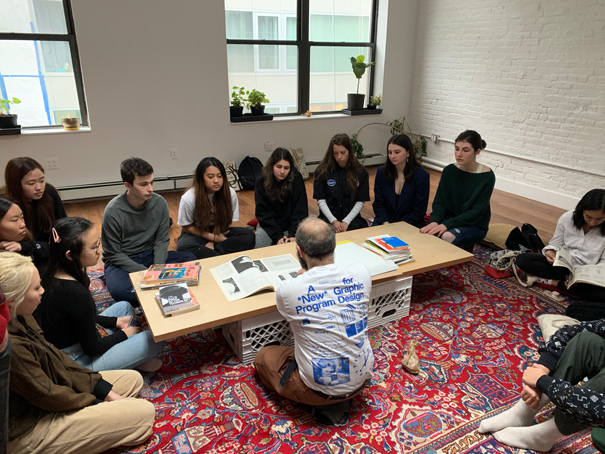

### Friday, Lab

- Review Coding from Life excercise.
- Discuss [Typography and Layouts on the Web](https://paper.dropbox.com/doc/Typography-and-Layouts-on-the-Web--AuVWeK6rDXqxmgKhFMamvTYoAg-dn6JY3DKILDMfZyLI1pxE)

### Homework

- Finish creating the digital layout of your Net Art Anthology piece. You'll need to incorporate each of the topics we discussed in the Typography and Layouts on the Web lecture. These include:
  - Custom font
  - Modular type system made using CSS classes
  - A column structure using flexbox
  - A grid using CSS Grid
  - Media queries for a different mobile layout
  - Media query to control print styles

---

### Thursday, Studio

- Ani presents on [The New Web Typography](https://www.robinrendle.com/essays/the-new-web-typography)
- Project announcement: Aim to have your interview content by 02/20 if possible (02/24 at the latest)
- Common theme in interview questions – aim for a constructed narrative rather than a biography.
- [Editorial examples, Type Demo and In Class Activity](https://paper.dropbox.com/doc/Week-4-Editorial-Examples-Type-Online--AuMn9NHBjPdyidb9SUv2oUuQAQ-OuUr7KTbxFBE1zHTMVAlq)

### Homework
- Send out your interview ASAP with the edits I provided. Aim to have your answers by 02/20 (02/24 at the latest)
- Continue researching your topic and collect 10 more posts to your are.na channel aiming to have a mix of visual research and documentation around your topic.
- Complete your in class activity

---

### Tuesday, Studio

- Fieldtrip to the cybernetics library!

### Homework
- Due THURSDAY: Read [The New Web Typography](https://www.robinrendle.com/essays/the-new-web-typography) and write a [discussion question](https://paper.dropbox.com/doc/CI-20-Reading-Questions--AuMlNmkhwj8VbSY~tG8Mkc1tAQ-j3rwtmto4gYuFZgXYRlAj). Discussion leader is Ani, please make sure to introduce Jan Tschichold (mentioned in reading) in your presentation.
- Send out your interview (once I respond to your email)
- Create an [are.na account](https://www.are.na/) and create a channel for this project. Start researching your idea – have at least 10 posts saved by Thursday (can be articles, visual research, sketches etc.)

---
